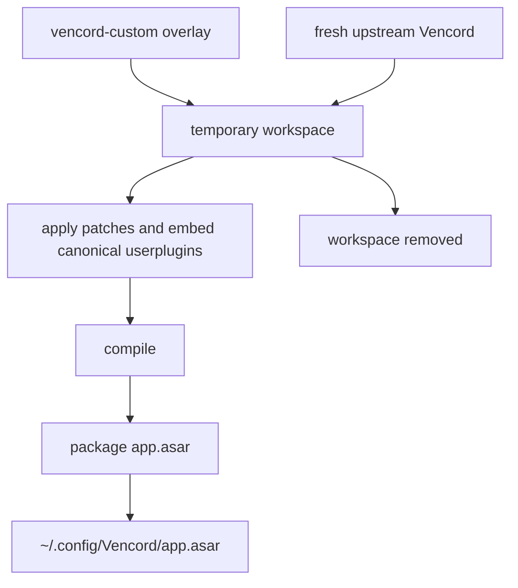

# vencord-custom

A source overlay for [Vencord](https://github.com/Vendicated/Vencord). It builds against a fresh upstream checkout and installs one persistent compiled runtime: `~/.config/Vencord/app.asar`.

There is no Vencord fork, persistent upstream checkout, committed build output, CI artifact, or prebuilt release.

## Included customizations

- **PlatformSpoofer** — changes the client platform reported by Discord (Desktop, Mobile, Web, or Console).
- **QuestCompleter** — automates supported Discord Quest tasks.
- **SteamRichPresence** — detects Steam games running on the Linux host and publishes their Steam name, artwork, description, elapsed time, and store link as Discord Rich Presence. Inspired by [mbutsk/open-drpc](https://github.com/mbutsk/open-drpc), but implemented as a native Vencord plugin with no Python daemon or extra runtime dependencies.
- **Translate patch** — immersive incoming-message translation and automatic translation behavior.
- **User Plugin Manager** — inspects, stages, installs, updates, adopts, and removes user plugins from Vencord's Plugins settings. Changes are applied transactionally and rebuild the complete runtime.
- **Updater integration** — Vencord's normal updater fetches fresh upstream and the current custom overlay, rebuilds in a temporary workspace, and atomically replaces `app.asar`.
- **Flatpak restart** — after a manager rebuild, Discord relaunches through a delayed host command so Flatpak's single-instance lock can clear first.

## Install

```sh
sh -c "$(curl -sS https://raw.githubusercontent.com/DarkPhilosophy/vencord-custom/main/install.sh)"
```

Requirements: `git`, `node`, `pnpm` (or Corepack), `curl`, `tar`, `python3`, and permission to update Discord's loader `app.asar`. The installer may request `sudo` only when the system Discord resources directory is not user-writable.

The installer:

1. downloads this overlay when it is not run from a local checkout;
2. clones a fresh upstream Vencord checkout into a temporary directory;
3. overlays `core/src/` and `userplugins/`, then applies the custom patches;
4. installs build dependencies and compiles only inside that temporary checkout;
5. packages the compiled runtime as `~/.config/Vencord/app.asar`;
6. installs a small loader into Discord's own `resources/app.asar`;
7. removes temporary source, dependencies, patches, and build output.

Existing Vencord settings are preserved. No persistent `dist/`, `node_modules/`, cloned Vencord source, or `userPluginSeeds/` directory is required.

## Updating

In Discord, open:

**Settings → Vencord → Updater → Check for updates**

The update path follows the same clean-build model as installation. Its workspace lives temporarily under `~/.config/Vencord/.update-*` and is removed after the build. The resulting `app.asar` is the only persistent compiled artifact.

## Runtime layout

```text
~/.config/Vencord/
├── app.asar     # complete compiled custom Vencord runtime
└── settings/    # persistent Vencord/user settings
```

For Flatpak Discord, the installer grants the app access to `~/.config/Vencord` so the loader can read the runtime.

## Repository layout

```text
vencord-custom/
├── core/src/                         # active User Plugin Manager overlay
├── userplugins/                      # canonical custom plugin sources
│   ├── _shared/author.ts
│   ├── platformSpoofer/
│   ├── questCompleter/
│   └── steamRichPresence/
├── patches/
│   ├── translate.patch               # Translate customization
│   ├── update.patch                  # temporary clean-build updater
│   └── userplugin-manager.patch      # Vencord/Electron manager wiring
├── scripts/
│   ├── package-vencord-asar.sh
│   └── stage-userplugin-seeds.sh
├── tests/
│   ├── userPluginManager/
│   ├── package-vencord-asar.sh
│   └── steamRichPresence.test.ts
└── install.sh
```

`userplugins/` is the canonical plugin source. `core/src/` is not a duplicate: it is the manager implementation copied into the temporary upstream checkout. Generated `core/dist/userPluginSeeds/` output is obsolete and must not be retained or packaged.

## Build flow



## Verification

Focused local checks:

```sh
pnpm dlx tsx --test tests/steamRichPresence.test.ts
sh tests/package-vencord-asar.sh
```

The complete install/build path is exercised by running `./install.sh` from the repository root.

## License

This project and its custom plugins are licensed under GPL-3.0-or-later. Vencord is copyright Vendicated and contributors and is also GPL-3.0-or-later.

See [`LICENSE`](../LICENSE) and [`THIRD_PARTY_NOTICES.md`](THIRD_PARTY_NOTICES.md).
