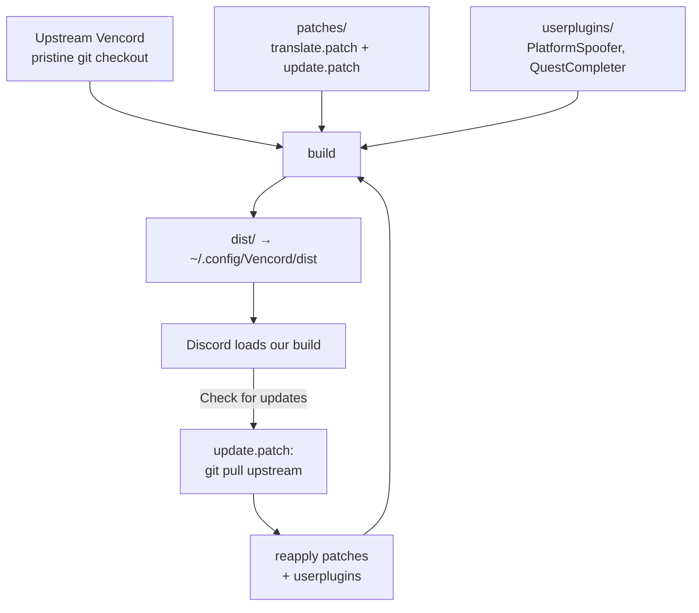

# vencord-custom

Personal custom [Vencord](https://github.com/Vendicated/Vencord) plugins, packaged for one-line install.

## Principle — upstream stays upstream

This repo contains **only our own code**. It never contains a copy of Vencord and never modifies the upstream tree in place.

| Layer | What | Where |
|-------|------|-------|
| **upstream** | real Vencord, fetched from Vendicated/Vencord | `Vencord/` (gitignored, cloned by the installer) |
| **our new plugins** | code that does not exist upstream | `userplugins/` |
| **our patches over upstream** | tweaks to an existing upstream plugin | `patches/` |

Upstream is cloned pristine into `Vencord/` (gitignored, never committed here). Our new plugins live in `userplugins/`; our changes to upstream files live as patches in `patches/`, applied on top. No fork, no mixing.

## How it works

Everything is an **overlay on a pristine upstream Vencord** — nothing is forked.



- **Build** — upstream + our patches + our userplugins, compiled into `dist/`. The upstream tree is never committed or forked; patches apply on top, at build time.
- **Load** — Discord's `app.asar` is patched to `require` our `dist/patcher.js` on every launch.
- **Auto-update** — Discord's built-in *Check for updates* runs `git pull` on the upstream checkout; `update.patch` hooks its build step to reapply our patches + userplugins first. So every update stays *latest upstream + our overlay*, and it re-patches the updater itself — self-perpetuating, never a version of our own.

## Plugins

- **PlatformSpoofer** — spoof client platform (Desktop/Mobile/Web/Console). *(new plugin → `userplugins/`)*
- **QuestCompleter** — complete Discord Quests without the game installed (video + play/stream via heartbeat spoof). *(new plugin → `userplugins/`)*
- **Translate** — immersive / automatic incoming translation. *(patch over the upstream Translate plugin → `patches/translate.patch`)*
- **Integrated auto-update** — teaches Vencord's own updater to reapply our overlay after each upstream pull. *(patch over the upstream updater → `patches/update.patch`)*

## Install

```sh
sh -c "$(curl -sS https://raw.githubusercontent.com/DarkPhilosophy/vencord-custom/main/install.sh)"
```

The installer clones a pristine upstream Vencord into the package, applies our patches, builds, injects into Discord, and (on flatpak) grants the portal permission the built-in updater needs. This is the **integrated** model: the checkout + toolchain stay so Discord's own "Check for updates" can pull upstream and rebuild with our patches.

> Needs `git`, `node`, `pnpm`, `curl`, and working `git` access to GitHub (the built-in updater runs `git pull`). Override the source with `VENCORD_CUSTOM_REPO=<git url>`.

## Usage

```sh
./vencord.sh install     # clone upstream + apply patches + build + inject
./vencord.sh build       # apply patches + build only
./vencord.sh update      # revert → git pull upstream → reapply patches → rebuild
./vencord.sh save-patch  # regenerate patches/*.patch from the current tree
./vencord.sh revert      # restore pristine upstream files
```

## Layout & footprint

The **repository** holds only our code — upstream Vencord is never committed:

```
vencord-custom/
├─ userplugins/
│  ├─ _shared/author.ts     # our author metadata (no fork of constants.ts)
│  ├─ platformSpoofer/
│  └─ questCompleter/
├─ patches/
│  ├─ translate.patch       # immersive/auto Translate (over upstream plugin)
│  └─ update.patch          # integrated auto-update (over upstream updater)
├─ install.sh               # installer (curl | sh)
└─ vencord.sh               # build / inject / update
```

On any machine a persistent `Vencord/` git checkout lives inside the package (gitignored); Discord loads from `Vencord/dist` (via `~/.config/Vencord/dist`), and the built-in updater keeps it current — pulling upstream and reapplying our patches. The checkout + toolchain stay on disk on purpose: that is what enables integrated updates.

## Updating Vencord

Two ways, both preserve our overlay:
- **In Discord:** Settings → Updater → Check for updates. `update.patch` makes the built-in updater reapply our patches after pulling upstream, then rebuild. On flatpak this needs the portal permission the installer grants plus working `git` access to GitHub.
- **CLI:** `./vencord.sh update`. If upstream drifted so a patch no longer applies, fix the file once, then `./vencord.sh save-patch`.

## License & attribution

GPL-3.0-or-later. This package derives from and links against [Vencord](https://github.com/Vendicated/Vencord) (GPL-3.0-or-later), so it is distributed under the same terms. See [`LICENSE`](../LICENSE) and [`THIRD_PARTY_NOTICES.md`](THIRD_PARTY_NOTICES.md).
