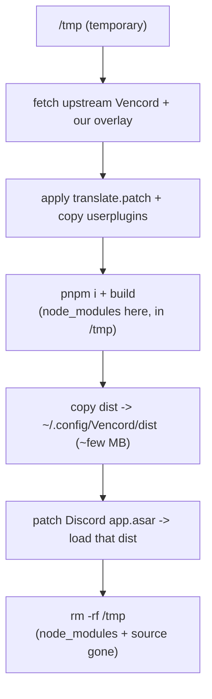

# vencord-custom

Personal custom [Vencord](https://github.com/Vendicated/Vencord) build: our plugins + our patches, installed with one command. No fork, no CI, no leftovers.

## What it contains

- **PlatformSpoofer** — spoof client platform (Desktop/Mobile/Web/Console). *(new plugin → `userplugins/`)*
- **QuestCompleter** — complete Discord Quests without the game (video + play/stream via heartbeat spoof). *(new plugin → `userplugins/`)*
- **Translate** — immersive / automatic incoming translation. *(patch over the upstream Translate plugin → `patches/translate.patch`)*

The repo holds **only our code** — upstream Vencord is never committed here.

## Install / update

```sh
sh -c "$(curl -sS https://raw.githubusercontent.com/DarkPhilosophy/vencord-custom/main/install.sh)"
```

Same command installs and updates — just run it again to update.

## How it works



Everything is built **live, in a temp dir**, which is deleted on exit — including `node_modules` (~300 MB) and the Vencord source. The build compiles `upstream + our patches + our plugins` into `dist/`, copies that (~few MB) to `~/.config/Vencord/dist`, and points Discord at it.

**On disk afterwards — nothing extra:**
- `~/.config/Vencord/dist` — the built bundle Discord loads (required)
- `~/.config/Vencord/settings/` — your Vencord settings
- Discord's patched `app.asar`

No `node_modules`, no source checkout, no symlinks, no `~/.local/share`. To update, re-run the command (it rebuilds live and replaces the bundle).

> Requires `git`, `node`, `pnpm` (or `corepack enable`), `curl`, `tar`. On a system flatpak Discord the app.asar patch needs `sudo`.

## Structure

```
vencord-custom/
├─ userplugins/
│  ├─ _shared/author.ts     # our author metadata (no fork of constants.ts)
│  ├─ platformSpoofer/
│  └─ questCompleter/
├─ patches/translate.patch  # our only change over upstream code
└─ install.sh               # build-live installer (curl | sh)
```

## Updating when upstream changes the Translate plugin

If a Vencord update changes `src/plugins/translate` enough that `translate.patch` no longer applies, fix a local checkout's `src/plugins/translate` by hand once and regenerate the patch with `git diff src/plugins/translate > patches/translate.patch`.

## License & attribution

GPL-3.0-or-later. This package derives from and links against [Vencord](https://github.com/Vendicated/Vencord) (GPL-3.0-or-later), so it is distributed under the same terms. See [`LICENSE`](../LICENSE) and [`THIRD_PARTY_NOTICES.md`](THIRD_PARTY_NOTICES.md).
