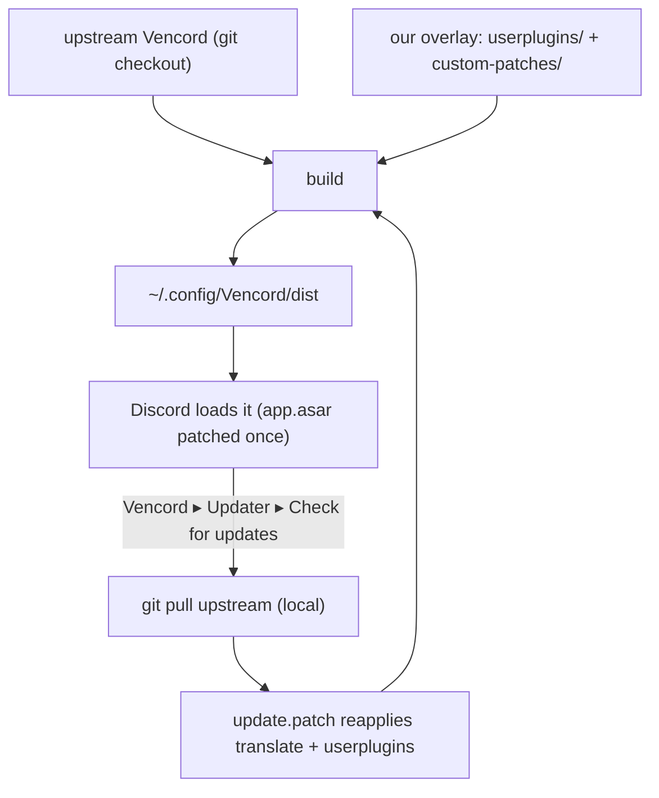

# vencord-custom

Personal custom [Vencord](https://github.com/Vendicated/Vencord): our plugins + our patches, layered on top of upstream — with Vencord's own updater taught to keep our overlay. No fork, no CI, no prebuilt releases.

## What it contains

- **PlatformSpoofer** — spoof client platform (Desktop/Mobile/Web/Console). *(new plugin → `userplugins/`)*
- **QuestCompleter** — complete Discord Quests without the game (video + play/stream via heartbeat spoof). *(new plugin → `userplugins/`)*
- **Translate** — immersive / automatic incoming translation. *(patch over the upstream Translate plugin → `patches/translate.patch`)*
- **Integrated updater** — Vencord's own Updater reapplies our overlay after each upstream pull, and shows a note explaining the custom source. *(patch over the upstream updater → `patches/update.patch`)*

The repo holds **only our code** — upstream Vencord is never committed here.

## Install

```sh
sh -c "$(curl -sS https://raw.githubusercontent.com/DarkPhilosophy/vencord-custom/main/install.sh)"
```

Sets up an upstream Vencord checkout at `~/.config/Vencord`, bakes in our overlay, builds, and points Discord at `~/.config/Vencord/dist`.

## How it works — `upstream + ours = your Vencord`



Nothing is prebuilt or forked. The build happens **locally**: upstream + our patches + our plugins → `dist`. Discord's `app.asar` is patched **once** to load `~/.config/Vencord/dist`.

**Updating** uses Vencord's own Updater (Settings → Vencord → Updater → *Check for updates*): it `git pull`s the latest upstream **locally**, and `update.patch` makes it reapply our patches + userplugins before rebuilding — so you always get *latest upstream + our overlay*, never a plain reset. The Updater tab also shows a note explaining this. No prebuilt download, no CI.

## Footprint (the honest cost)

Because the in-app updater rebuilds **locally**, the checkout + build toolchain stay under `~/.config/Vencord`:

- `~/.config/Vencord/` — upstream source + `src/userplugins/` (ours) + `custom-patches/` (ours) + `node_modules` (build toolchain, ~300 MB) + `dist/` (what Discord loads) + `settings/`.

That `node_modules` is what lets *Check for updates* recompile with our patches — the same as any Vencord dev install. No symlinks, no `~/.local/share`, one location. (Want it tiny instead, at the cost of the in-app button? Then you'd rebuild from scratch on each update instead — ask and we can switch models.)

## Structure (this repo)

```
vencord-custom/
├─ userplugins/
│  ├─ _shared/author.ts     # our author metadata (no fork of constants.ts)
│  ├─ platformSpoofer/
│  └─ questCompleter/
├─ patches/
│  ├─ translate.patch       # immersive/auto Translate (over upstream plugin)
│  └─ update.patch          # integrated updater: reapply overlay + info note
└─ install.sh               # local-build installer (curl | sh)
```

## When upstream changes the patched files

If a Vencord update changes `src/plugins/translate` or `src/main/updater` enough that a patch no longer applies, fix the file in `~/.config/Vencord` by hand once and regenerate: `git -C ~/.config/Vencord diff <path> > patches/<name>.patch`.

## License & attribution

GPL-3.0-or-later. Derives from and links against [Vencord](https://github.com/Vendicated/Vencord) (GPL-3.0-or-later). See [`LICENSE`](../LICENSE) and [`THIRD_PARTY_NOTICES.md`](THIRD_PARTY_NOTICES.md).
