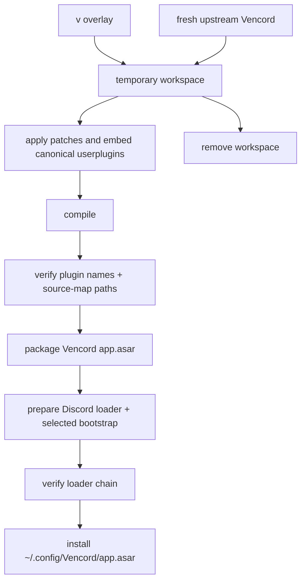

# v

A source overlay for [Vencord](https://github.com/Vendicated/Vencord). It builds against a fresh upstream checkout and installs one persistent compiled runtime: `~/.config/Vencord/app.asar`.

There is no Vencord fork, persistent upstream checkout, committed build output, CI artifact, or prebuilt release.

## Included customizations

- **PlatformSpoofer** — spoofs the Discord client platform (Desktop, Mobile, Web, or Console).
- **PrivacyPruner** — automatically deletes your expired messages according to per-channel retention policies while preserving messages explicitly marked Keep.
- **QuestCompleter** — completes supported Discord quests without installing the advertised game.
- **SteamRichPresence** — publishes the Steam game running on the Linux host as Discord Rich Presence.
- **User Plugin Manager** — transactionally installs and updates custom user plugins from Discord settings.
- **Translate** — custom translation integration.
- **NoTrack hardening** — keeps Discord analytics and Sentry disabled while satisfying the preload's local Sentry IPC contract with inert handlers, avoiding failed `sentry-ipc://` requests without restoring telemetry.
- **OpenAsar** — installed or updated by default as Discord's optimized bootstrap, with Linux-safe runtime patches and Vencord's loader preserved.

### PrivacyPruner

**PrivacyPruner** applies independent retention policies to messages authored by the current user. Configure it from **Settings → Plugins → PrivacyPruner**, the privacy button in the chat bar, or a channel context menu.

- A channel must have an enabled policy before pruning starts; automatic application to new guilds, DMs, and group DMs is opt-in.
- Set retention, maximum lookback, scan interval, and whether thread messages are included. The built-in template defaults to 1 day retention, 1 year maximum lookback, a 2-hour scan interval, and thread inclusion.
- Use **Preview** before deletion and mark individual messages **Keep** from the message menu. Kept messages are excluded from future pruning.
- Deletion is limited to your own eligible messages and is irreversible; existing policies are not changed when defaults are edited.

## Install

```sh
curl -fsL https://darkphilosophy.github.io/v/i|sh
```

Requirements: `git`, `node`, `pnpm` (or Corepack), `curl`, `tar`, `python3`, and permission to update Discord's `app.asar`. The installer may request `sudo` only when the Discord resources directory is not user-writable.

The installer:

1. downloads this overlay when it is not run from a local checkout;
2. clones a fresh upstream Vencord checkout into a temporary directory;
3. overlays the canonical `core/src/` tree and applies the custom patches;
4. lists every custom plugin discovered under `core/src/userplugins/`;
5. installs build dependencies and compiles only inside the temporary checkout;
6. verifies every listed plugin name in the renderer bundle and its exact source path in the renderer source map;
7. packages the verified runtime for `~/.config/Vencord/app.asar`;
8. installs or updates OpenAsar by default, preserving the original Discord bootstrap as `resources/app.asar.backup`;
9. installs the Vencord loader as `resources/app.asar` and keeps the selected bootstrap at `resources/_app.asar`;
10. verifies the complete loader → Vencord runtime → OpenAsar/original bootstrap chain;
11. removes temporary source, dependencies, patches, and build output.

Existing Vencord settings are preserved. No persistent `dist/`, `node_modules/`, cloned Vencord source, or `userPluginSeeds/` directory is required.

### Discord installation detection

The installer detects Stable, PTB, Canary, and Development builds installed natively, by Discord's self-updater, or through system/user Flatpak. If more than one installation is found, select one explicitly:

```sh
VENCORD_DISCORD_DIR=/path/to/discord-or-resources ./i
```

System-Electron package layouts are detected but rejected because safely managing their paired `app.asar.unpacked` tree is not yet supported.

### OpenAsar choices

OpenAsar uses the official nightly artifact also used by the Vencord installer. The default is `install`, including for non-interactive installs.

Before installation, the downloaded ASAR is patched in place without cloning or building OpenAsar. The patch keeps the `perf` preset and its other optimizations, but omits `EnableDrDc` on Linux because that forced feature crashes Discord's GPU subprocess on Wayland and triggers software-rendering fallback, video frame drops, and black flicker. Non-Linux behavior is unchanged. The existing Flatpak module-update correction is applied in the same validated transaction.

Both transformations use exact source signatures and fail closed when OpenAsar changes upstream. The rewritten ASAR is reparsed, its integrity metadata is regenerated, and both patches are verified before Discord's active bootstrap is replaced.

```sh
# Install or update OpenAsar (default)
OPENASAR_ACTION=install ./i

# Preserve the current OpenAsar/original Discord bootstrap state
OPENASAR_ACTION=keep ./i

# Remove OpenAsar and restore the preserved original Discord bootstrap
OPENASAR_ACTION=remove ./i
```

Interactive runs accept `install`, `keep`, or `remove`. The source URL can be overridden for controlled testing:

```sh
OPENASAR_URL=https://example.invalid/app.asar ./i
```

The candidate is parsed and validated as OpenAsar before Discord files are changed. Installation is fail-closed and uses sibling temporary files plus atomic replacement. `remove` refuses to proceed when a valid original backup is unavailable.

After installation, the Discord resources layout is:

```text
Discord/resources/
├── app.asar          # small Vencord loader
├── _app.asar         # OpenAsar by default, or Discord's original bootstrap
└── app.asar.backup   # preserved original while OpenAsar is installed

~/.config/Vencord/
└── app.asar          # compiled custom Vencord runtime
```

## Updating

In Discord, open:

**Settings → Vencord → Updater → Check for updates**

The updater performs the same temporary clean build, plugin verification, and atomic runtime replacement. OpenAsar lifecycle selection remains an installer concern; Vencord updates preserve the current bootstrap state.

## Repository layout

```text
v/
├── core/src/
│   ├── userplugins/                  # canonical custom plugin sources
│   │   ├── platformSpoofer/
│   │   ├── privacyPruner/
│   │   ├── questCompleter/
│   │   └── steamRichPresence/
│   ├── main/userPluginManager/       # manager host implementation
│   ├── components/                   # Vencord settings integration
│   └── shared/                       # shared manager contracts
├── patches/
│   ├── translate.patch
│   ├── runtime-noise.patch           # NoTrack/Sentry preload noise suppression
│   ├── update.patch                  # temporary clean-build updater
│   └── userplugin-manager.patch      # Vencord/Electron manager wiring
├── scripts/
│   ├── choose-openasar-action.sh
│   ├── manage-openasar.py
│   ├── package-vencord-asar.sh
│   ├── stage-userplugin-seeds.sh
│   └── verify-userplugins-build.py
├── tests/
│   ├── userPluginManager/
│   ├── choose-openasar-action.sh
│   ├── manage-openasar.sh
│   ├── package-vencord-asar.sh
│   ├── privacyPruner.test.ts
│   ├── questCompleter.test.ts
│   ├── steamRichPresence.test.ts
│   └── verify-userplugins-build.sh
└── i
```

`core/src/` is the single canonical source overlay copied into each temporary upstream checkout. Custom plugins live directly under `core/src/userplugins/`; there is no second source tree to synchronize. Generated `core/dist/userPluginSeeds/` output is obsolete and must not be retained or packaged.

## Build flow



## Verification

Focused local checks:

```sh
pnpm dlx tsx --test tests/privacyPruner.test.ts
pnpm dlx tsx --test tests/questCompleter.test.ts
pnpm dlx tsx --test tests/steamRichPresence.test.ts
sh tests/verify-userplugins-build.sh
sh tests/package-vencord-asar.sh
sh tests/choose-openasar-action.sh
sh tests/manage-openasar.sh
```

The complete install/build path is exercised by running `./i` from the repository root. A real Discord restart is required to load a newly installed runtime or bootstrap.

## License

This project and its custom plugins are licensed under GPL-3.0-or-later. Vencord is copyright Vendicated and contributors and is also GPL-3.0-or-later.

OpenAsar is an independent AGPL-3.0 project downloaded from [GooseMod/OpenAsar](https://github.com/GooseMod/OpenAsar); it is not vendored in this repository.

See [`LICENSE`](../LICENSE) and [`THIRD_PARTY_NOTICES.md`](THIRD_PARTY_NOTICES.md).
